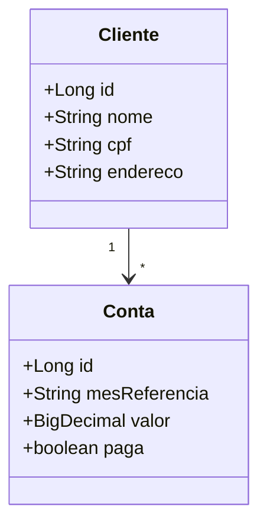

# Projeto DIO - RESTFul API 

## Diagrama de Classes

```mermaid
classDiagram
  class Cliente {
    +Long id
    +String nome
    +String cpf
    +String endereco
  }

  class Conta {
    +Long id
    +String mesReferencia
    +BigDecimal valor
    +boolean paga
  }

  Cliente "1" --> "*" Conta
```
